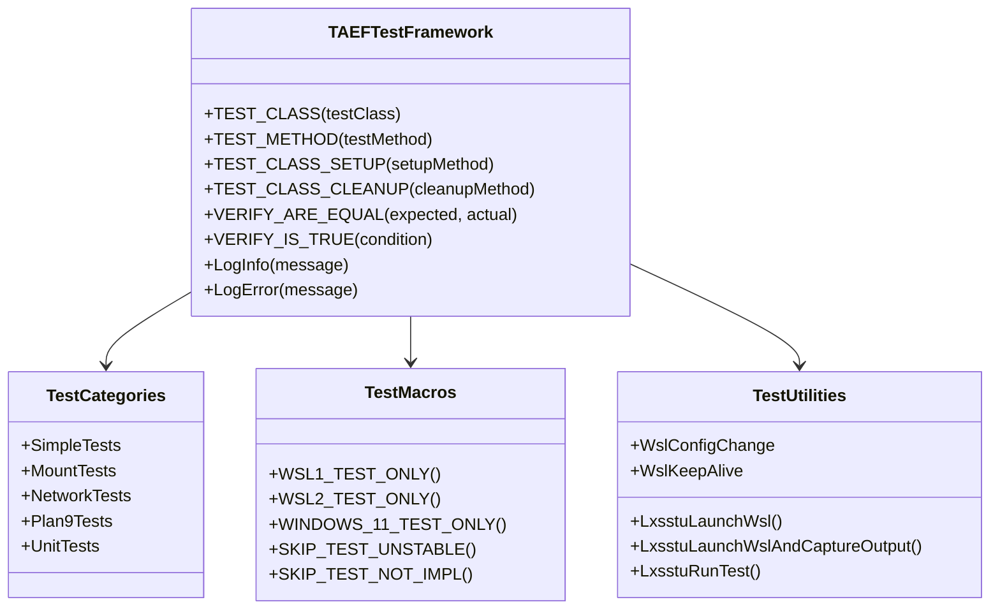
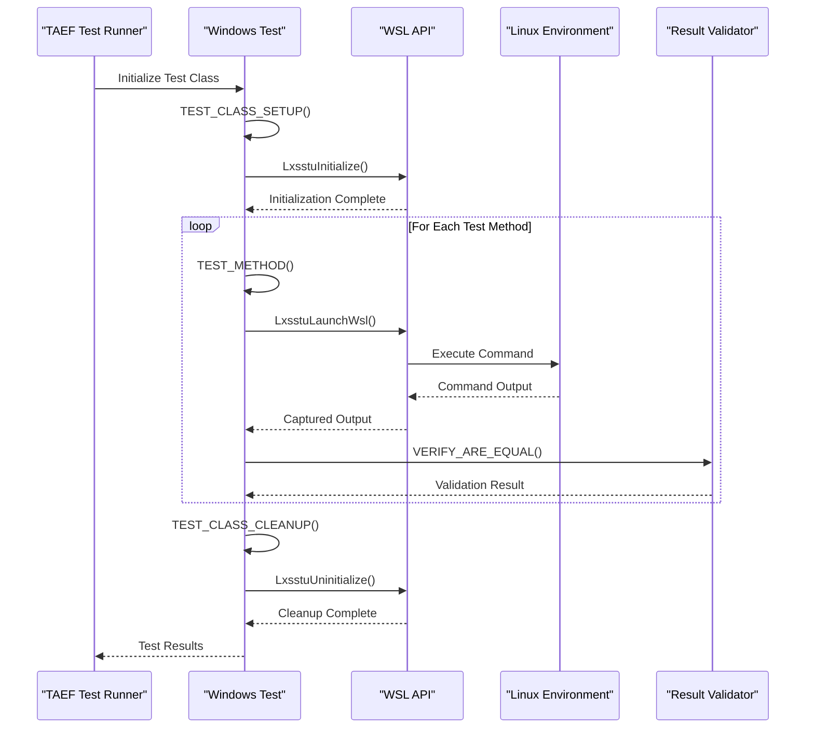
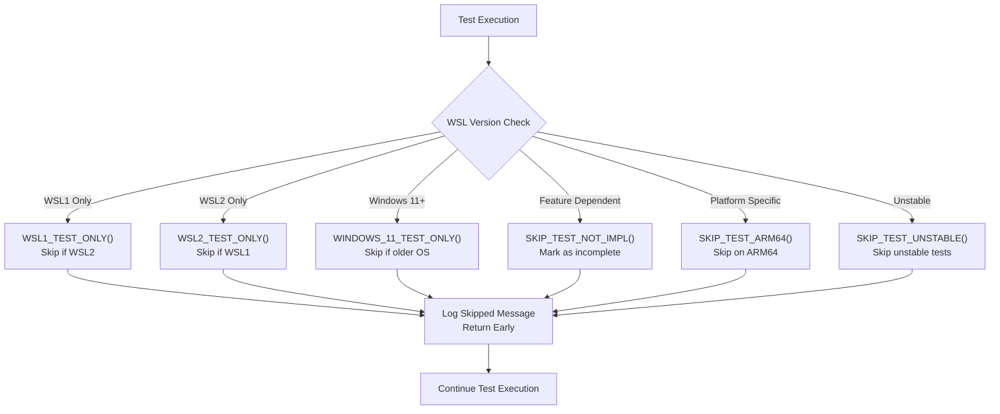
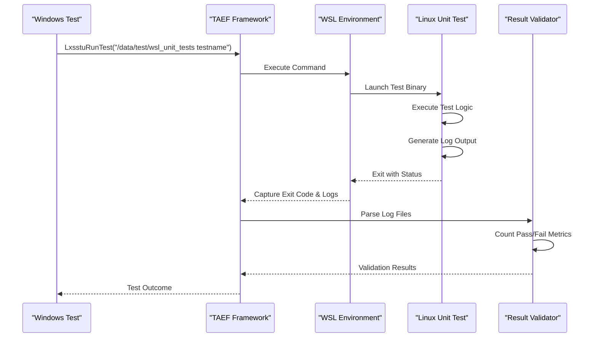

# Test Types and Coverage

<cite>
**Referenced Files in This Document**
- [test/windows/SimpleTests.cpp](file://test/windows/SimpleTests.cpp)
- [test/windows/MountTests.cpp](file://test/windows/MountTests.cpp)
- [test/windows/NetworkTests.cpp](file://test/windows/NetworkTests.cpp)
- [test/windows/Plan9Tests.cpp](file://test/windows/Plan9Tests.cpp)
- [test/windows/UnitTests.cpp](file://test/windows/UnitTests.cpp)
- [test/windows/Common.h](file://test/windows/Common.h)
- [test/linux/unit_tests/unittests.h](file://test/linux/unit_tests/unittests.h)
- [test/linux/unit_tests/unittests.c](file://test/linux/unit_tests/unittests.c)
- [test/linux/unit_tests/build_tests.sh](file://test/linux/unit_tests/build_tests.sh)
- [test/README.md](file://test/README.md)
</cite>

## Table of Contents
1. [Introduction](#introduction)
2. [Test Infrastructure Overview](#test-infrastructure-overview)
3. [Windows-Side TAEF Tests](#windows-side-taef-tests)
4. [Linux-Side Unit Tests](#linux-side-unit-tests)
5. [Test Categories and Coverage Areas](#test-categories-and-coverage-areas)
6. [WSL Version Control Macros](#wsl-version-control-macros)
7. [Test Execution and Validation](#test-execution-and-validation)
8. [Best Practices and Guidelines](#best-practices-and-guidelines)
9. [Troubleshooting and Debugging](#troubleshooting-and-debugging)

## Introduction

The Windows Subsystem for Linux (WSL) employs a comprehensive dual-layer testing architecture that validates functionality across both Windows and Linux environments. This sophisticated testing framework ensures reliability and compatibility across different WSL versions and deployment scenarios. The testing infrastructure consists of two primary components: Windows-side tests using the Test Authoring and Execution Framework (TAEF) and Linux-side unit tests written in C, which validate low-level system call behavior and kernel-level functionality.

## Test Infrastructure Overview

The WSL testing framework operates on a hybrid architecture that bridges Windows and Linux environments to provide comprehensive validation of cross-platform functionality. This design enables testing of both the Windows host components and the Linux subsystem behavior within the WSL environment.

```mermaid
graph TB
subgraph "Windows Environment"
TAEF[TAEF Framework]
WinTests[Windows Tests]
TestRunner[Test Runner]
end
subgraph "WSL Environment"
LinuxTests[Linux Unit Tests]
WSLCore[WSL Core]
Kernel[Linux Kernel]
end
subgraph "Test Communication"
API[WSL API]
CLI[Command Line Interface]
IPC[Inter-Process Communication]
end
TAEF --> WinTests
WinTests --> TestRunner
TestRunner --> API
TestRunner --> CLI
API --> WSLCore
CLI --> WSLCore
WSLCore --> LinuxTests
LinuxTests --> Kernel
TestRunner < --> LinuxTests
```

**Diagram sources**
- [test/windows/Common.h](file://test/windows/Common.h#L1-L50)
- [test/linux/unit_tests/unittests.h](file://test/linux/unit_tests/unittests.h#L1-L50)

**Section sources**
- [test/README.md](file://test/README.md#L1-L50)
- [test/windows/Common.h](file://test/windows/Common.h#L1-L100)

## Windows-Side TAEF Tests

### TAEF Framework Architecture

The Windows-side testing infrastructure utilizes Microsoft's Test Authoring and Execution Framework (TAEF), a robust testing framework that provides comprehensive capabilities for Windows application testing. TAEF offers advanced features including test categorization, parameterized testing, and extensive logging capabilities.



**Diagram sources**
- [test/windows/Common.h](file://test/windows/Common.h#L96-L110)
- [test/windows/SimpleTests.cpp](file://test/windows/SimpleTests.cpp#L18-L30)

### Test Execution Flow

Windows tests execute through a structured pipeline that involves initialization, test execution, and validation phases. The framework provides comprehensive logging and error reporting capabilities to facilitate debugging and continuous integration.



**Diagram sources**
- [test/windows/SimpleTests.cpp](file://test/windows/SimpleTests.cpp#L24-L35)
- [test/windows/Common.h](file://test/windows/Common.h#L380-L400)

### Test Categories Implementation

The Windows-side tests are organized into distinct categories, each targeting specific functionality areas within WSL. Each category implements standardized initialization and cleanup procedures while maintaining focused test scopes.

**Section sources**
- [test/windows/SimpleTests.cpp](file://test/windows/SimpleTests.cpp#L18-L266)
- [test/windows/MountTests.cpp](file://test/windows/MountTests.cpp#L1-L100)
- [test/windows/NetworkTests.cpp](file://test/windows/NetworkTests.cpp#L1-L100)
- [test/windows/Plan9Tests.cpp](file://test/windows/Plan9Tests.cpp#L1-L100)

## Linux-Side Unit Tests

### C-Based Unit Test Framework

The Linux-side testing infrastructure consists of a collection of C-based unit tests that validate low-level Linux system call behavior and kernel-level functionality. These tests are compiled into a single executable that can be invoked from Windows tests to validate WSL's Linux subsystem behavior.

```mermaid
flowchart TD
BuildScript["build_tests.sh<br/>make -j8 -k -C /data/test"] --> CompileTests["Compile Individual Tests"]
CompileTests --> TestBinary["wsl_unit_tests<br/>Single Executable"]
TestBinary --> TestSelector["Test Selector<br/>Parse Arguments"]
TestSelector --> AuxvTest["auxv Test"]
TestSelector --> BinFmtTest["binfmt Test"]
TestSelector --> CgroupTest["cgroup Test"]
TestSelector --> DupTest["dup Test"]
TestSelector --> EpollTest["epoll Test"]
TestSelector --> ExecveTest["execve Test"]
TestSelector --> FlockTest["flock Test"]
TestSelector --> ForkTest["fork Test"]
TestSelector --> GetSetIdTest["get_set_id Test"]
TestSelector --> InotifyTest["inotify Test"]
TestSelector --> InteropTest["interop Test"]
TestSelector --> MprotectTest["mprotect Test"]
TestSelector --> NamespaceTest["namespace Test"]
TestSelector --> NetlinkTest["netlink Test"]
TestSelector --> PipeTest["pipe Test"]
TestSelector --> RandomTest["random Test"]
TestSelector --> ResourceLimitsTest["resourcelimits Test"]
TestSelector --> SchedTest["sched Test"]
TestSelector --> SelectTest["select Test"]
TestSelector --> SemTest["sem Test"]
TestSelector --> ShmTest["shm Test"]
TestSelector --> SocketTest["socket_nonblock Test"]
TestSelector --> SpliceTest["splice Test"]
TestSelector --> SysfsTest["sysfs Test"]
TestSelector --> SysInfoTest["sysinfo Test"]
TestSelector --> TimerTest["timer Test"]
TestSelector --> TimerFdTest["timerfd Test"]
TestSelector --> TtyTest["tty Test"]
TestSelector --> UserTest["user Test"]
TestSelector --> VfsAccessTest["vfsaccess Test"]
TestSelector --> WaitPidTest["waitpid Test"]
TestSelector --> XattrTest["xattr Test"]
AuxvTest --> ValidationResult["Validation Result"]
BinFmtTest --> ValidationResult
CgroupTest --> ValidationResult
DupTest --> ValidationResult
EpollTest --> ValidationResult
ExecveTest --> ValidationResult
FlockTest --> ValidationResult
ForkTest --> ValidationResult
GetSetIdTest --> ValidationResult
InotifyTest --> ValidationResult
InteropTest --> ValidationResult
MprotectTest --> ValidationResult
NamespaceTest --> ValidationResult
NetlinkTest --> ValidationResult
PipeTest --> ValidationResult
RandomTest --> ValidationResult
ResourceLimitsTest --> ValidationResult
SchedTest --> ValidationResult
SelectTest --> ValidationResult
SemTest --> ValidationResult
ShmTest --> ValidationResult
SocketTest --> ValidationResult
SpliceTest --> ValidationResult
SysfsTest --> ValidationResult
SysInfoTest --> ValidationResult
TimerTest --> ValidationResult
TimerFdTest --> ValidationResult
TtyTest --> ValidationResult
UserTest --> ValidationResult
VfsAccessTest --> ValidationResult
WaitPidTest --> ValidationResult
XattrTest --> ValidationResult
```



**Diagram sources**
- [test/linux/unit_tests/unittests.c](file://test/linux/unit_tests/unittests.c#L19-L72)
- [test/linux/unit_tests/build_tests.sh](file://test/linux/unit_tests/build_tests.sh#L1-L1)

### Test Compilation and Execution

The Linux unit tests are compiled using a centralized build script that handles dependency resolution and parallel compilation. Each test is implemented as an independent function that can be invoked with specific parameters to validate targeted functionality.

**Section sources**
- [test/linux/unit_tests/unittests.c](file://test/linux/unit_tests/unittests.c#L1-L121)
- [test/linux/unit_tests/unittests.h](file://test/linux/unit_tests/unittests.h#L1-L207)
- [test/linux/unit_tests/build_tests.sh](file://test/linux/unit_tests/build_tests.sh#L1-L1)

## Test Categories and Coverage Areas

### SimpleTests: Basic WSL Command Validation

SimpleTests focuses on fundamental WSL functionality validation, ensuring core commands and basic operations work correctly across different WSL configurations.

| Test Category | Coverage Area | Purpose |
|---------------|---------------|---------|
| **EchoTest** | Basic command execution | Validates simple shell command execution |
| **WhoamiTest** | User identity verification | Ensures proper user context handling |
| **ChangeDirTest** | Working directory management | Validates directory navigation functionality |
| **Daemonize** | Background process handling | Tests process lifecycle management |
| **StringHelpers** | Utility function validation | Validates string manipulation utilities |

**Section sources**
- [test/windows/SimpleTests.cpp](file://test/windows/SimpleTests.cpp#L37-L170)

### MountTests: WSL --mount Functionality

MountTests comprehensively validates the `wsl --mount` functionality, covering various mounting scenarios and disk partition management.

| Test Category | Coverage Area | WSL Version Support |
|---------------|---------------|-------------------|
| **Bare Mount** | Direct disk attachment | WSL1/WSL2 |
| **Partition Mount** | Single partition mounting | WSL1/WSL2 |
| **Multiple Partitions** | Multi-partition mounting | WSL1/WSL2 |
| **VHD Mount** | Virtual Hard Disk mounting | WSL1/WSL2 |
| **Mount State Management** | Persistence and restoration | WSL1/WSL2 |
| **Filesystem Detection** | Automatic filesystem recognition | WSL1/WSL2 |
| **Mount Options** | Advanced mounting parameters | WSL1/WSL2 |

**Section sources**
- [test/windows/MountTests.cpp](file://test/windows/MountTests.cpp#L1-L500)

### NetworkTests: Networking Features and Configurations

NetworkTests validates WSL's networking capabilities, including network configuration, firewall integration, and advanced networking features.

| Test Category | Coverage Area | Feature Dependencies |
|---------------|---------------|---------------------|
| **Basic Connectivity** | Network interface management | Basic WSL networking |
| **Routing Tables** | IP routing configuration | IPv4/IPv6 routing |
| **Firewall Integration** | Windows Defender integration | Hyper-V firewall |
| **DNS Tunneling** | DNS traffic interception | Experimental features |
| **Mirrored Networking** | Direct network access | Windows 11+ |
| **Proxy Configuration** | HTTP proxy support | WinHTTP APIs |
| **Network Isolation** | Security boundary enforcement | Network policies |

**Section sources**
- [test/windows/NetworkTests.cpp](file://test/windows/NetworkTests.cpp#L1-L800)

### Plan9Tests: Plan 9 Filesystem Operations

Plan9Tests validates the Plan 9 filesystem implementation, focusing on file and directory operations within the WSL environment.

| Test Category | Coverage Area | Access Control |
|---------------|---------------|----------------|
| **File Operations** | Creation, deletion, modification | Plan 9 permissions |
| **Directory Operations** | Listing, traversal, management | Directory access |
| **I/O Operations** | Read/write operations | File descriptor handling |
| **Mount Points** | Virtual filesystem access | Mount namespace isolation |
| **Permission Validation** | Access control enforcement | User/group validation |
| **Server Timeout** | Session management | Connection lifecycle |

**Section sources**
- [test/windows/Plan9Tests.cpp](file://test/windows/Plan9Tests.cpp#L1-L570)

### UnitTests: Low-Level Linux System Call Behavior

UnitTests provides comprehensive validation of Linux system call behavior and kernel-level functionality within the WSL environment.

| Test Category | Coverage Area | System Level |
|---------------|---------------|--------------|
| **Process Management** | fork, exec, waitpid | Process lifecycle |
| **File Operations** | dup, fcntl, flock | File descriptor management |
| **Memory Management** | mmap, mprotect, brk | Memory allocation |
| **Signal Handling** | sigaction, kill | Signal delivery |
| **IPC Mechanisms** | pipes, sockets, shared memory | Inter-process communication |
| **System Information** | uname, sysinfo | System introspection |
| **Timing Operations** | timers, clock_gettime | Time management |
| **User Management** | getuid, setgid, groups | Identity management |

**Section sources**
- [test/windows/UnitTests.cpp](file://test/windows/UnitTests.cpp#L1-L800)

## WSL Version Control Macros

The testing framework employs sophisticated macros to control test execution based on WSL version and feature availability, ensuring tests run only in appropriate environments.

### Version-Specific Macros



**Diagram sources**
- [test/windows/Common.h](file://test/windows/Common.h#L39-L87)

### Macro Implementation Details

| Macro | Purpose | Usage Pattern |
|-------|---------|---------------|
| **WSL1_TEST_ONLY()** | Restricts to WSL1 environment | Conditional execution based on WSL version |
| **WSL2_TEST_ONLY()** | Restricts to WSL2 environment | Excludes WSL1-specific functionality |
| **WINDOWS_11_TEST_ONLY()** | Requires Windows 11+ | Feature availability validation |
| **SKIP_TEST_NOT_IMPL()** | Marks incomplete tests | Temporary exclusion of unfinished functionality |
| **SKIP_TEST_ARM64()** | Excludes ARM64 platforms | Platform-specific limitations |
| **SKIP_TEST_UNSTABLE()** | Excludes unstable tests | Prevents flaky test failures |

**Section sources**
- [test/windows/Common.h](file://test/windows/Common.h#L39-L87)

## Test Execution and Validation

### Cross-Platform Test Orchestration

The testing framework orchestrates test execution across both Windows and Linux environments, providing seamless integration between TAEF-based Windows tests and C-based Linux unit tests.



**Diagram sources**
- [test/windows/Common.cpp](file://test/windows/Common.cpp#L1876-L1924)

### Test Result Processing

The framework implements comprehensive result processing that parses Linux test logs to extract pass/fail metrics and integrates them with Windows test outcomes.

**Section sources**
- [test/windows/Common.cpp](file://test/windows/Common.cpp#L1675-L1728)

## Best Practices and Guidelines

### Test Development Guidelines

1. **Modular Test Design**: Each test should focus on a single functionality area with clear input/output expectations
2. **Resource Management**: Proper cleanup of test artifacts and resources to prevent test interference
3. **Error Handling**: Comprehensive error checking with meaningful error messages for debugging
4. **Version Compatibility**: Appropriate use of version-specific macros to ensure test applicability
5. **Logging**: Extensive logging for debugging and CI/CD integration

### Test Organization Principles

- **Category Separation**: Tests organized by functional area with minimal cross-category dependencies
- **Independent Execution**: Each test should be able to run independently without affecting others
- **Deterministic Results**: Tests produce consistent results across different execution environments
- **Performance Consideration**: Tests designed to complete within reasonable timeframes

## Troubleshooting and Debugging

### Common Test Issues

| Issue Category | Symptoms | Resolution Strategy |
|----------------|----------|-------------------|
| **WSL Initialization Failures** | Test startup timeouts | Verify WSL installation and configuration |
| **Cross-Platform Communication** | Test hangs or timeouts | Check WSL service status and network connectivity |
| **Permission Denied Errors** | Access control violations | Validate user permissions and security policies |
| **Version Compatibility** | Unexpected test skips | Verify WSL version and feature availability |
| **Resource Leaks** | Increasing memory usage | Implement proper cleanup in test teardown |

### Debugging Techniques

1. **Verbose Logging**: Enable detailed logging to capture test execution details
2. **Breakpoint Debugging**: Use TAEF's in-process debugging capabilities with WinDbg
3. **Log Analysis**: Parse test logs to identify failure patterns and root causes
4. **Environment Validation**: Verify WSL environment configuration and dependencies
5. **Incremental Testing**: Run individual tests to isolate problematic functionality

**Section sources**
- [test/README.md](file://test/README.md#L15-L75)