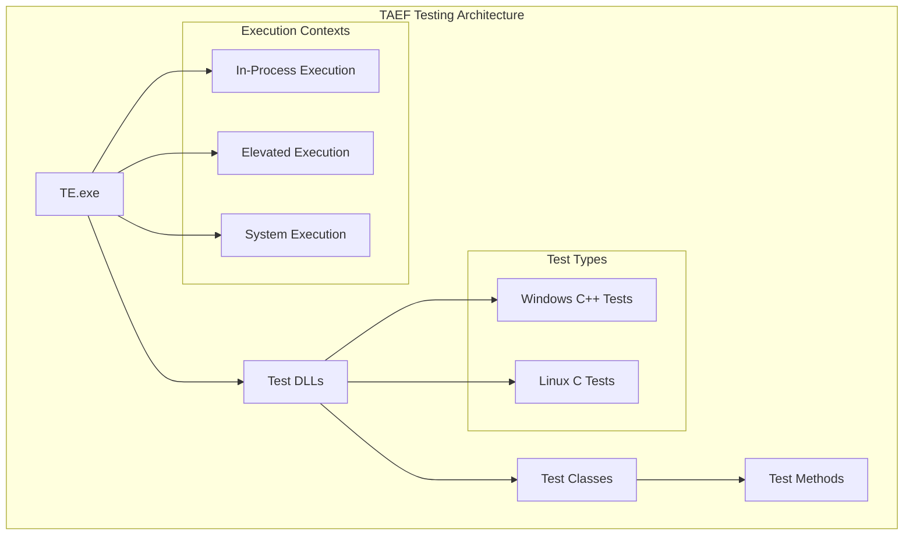

# Testing Framework

<cite>
**Referenced Files in This Document**
- [test/README.md](file://test/README.md)
- [test/windows/SimpleTests.cpp](file://test/windows/SimpleTests.cpp)
- [test/windows/MountTests.cpp](file://test/windows/MountTests.cpp)
- [test/windows/CMakeLists.txt](file://test/windows/CMakeLists.txt)
- [test/windows/Common.h](file://test/windows/Common.h)
- [test/windows/lxsstest.h](file://test/windows/lxsstest.h)
- [test/linux/unit_tests/Makefile](file://test/linux/unit_tests/Makefile)
- [test/linux/unit_tests/build_tests.sh](file://test/linux/unit_tests/build_tests.sh)
- [test/linux/unit_tests/unittests.h](file://test/linux/unit_tests/unittests.h)
- [test/linux/unit_tests/common.h](file://test/linux/unit_tests/common.h)
</cite>

## Table of Contents
1. [Introduction](#introduction)
2. [TAEF Framework Overview](#taef-framework-overview)
3. [Executing Tests with TE.exe](#executing-tests-with-teexe)
4. [Command-Line Parameters](#command-line-parameters)
5. [Test Creation Guidelines](#test-creation-guidelines)
6. [CMake Integration](#cmake-integration)
7. [Linux Unit Tests](#linux-unit-tests)
8. [Windows Test Implementation](#windows-test-implementation)
9. [Runtime Parameters](#runtime-parameters)
10. [Test Categories](#test-categories)
11. [Best Practices](#best-practices)

## Introduction

The WSL testing framework utilizes the Test Authoring and Execution Framework (TAEF) for comprehensive testing of Windows Subsystem for Linux functionality. This framework supports both Windows C++ tests and Linux C unit tests, providing extensive coverage of core WSL features including file system operations, networking, mount functionality, and system integration.

The testing infrastructure is designed to validate WSL's core functionality across different execution contexts, from basic smoke tests to complex integration scenarios involving virtual machines and network configurations.

## TAEF Framework Overview

TAEF (Test Authoring and Execution Framework) is Microsoft's comprehensive testing framework that provides robust test authoring capabilities and execution environments. The WSL project leverages TAEF for its Windows-based test suites, offering:

- **Structured Test Organization**: Hierarchical test class and method organization
- **Rich Assertion Library**: Comprehensive verification macros for test validation
- **Flexible Execution**: Support for various execution contexts and debugging scenarios
- **Parameterized Testing**: Runtime parameter injection for flexible test configuration
- **Cross-Platform Validation**: Integration between Windows and Linux test environments



**Section sources**
- [test/README.md](file://test/README.md#L1-L10)

## Executing Tests with TE.exe

### Basic Test Execution

Test execution follows a straightforward process using the TE.exe binary:

1. **Administrative Privileges**: Tests must be executed with administrative privileges
2. **Binary Navigation**: Navigate to the appropriate binary directory containing test DLLs
3. **Test Invocation**: Execute tests by passing test DLLs as arguments to TE.exe

```bash
# Basic test execution
TE.exe test1.dll test2.dll test3.dll

# Navigate to binary directory first
cd bin/x64/Release/
TE.exe wsltests.dll
```

### Administrative Requirements

All WSL tests require administrative privileges due to the nature of the subsystem being tested. This ensures proper access to system resources, virtual machine management, and privileged operations required for comprehensive testing.

### Binary Directory Navigation

Test binaries are organized in platform-specific directories:
- `bin/x64/Debug/` - Debug builds for x64 architecture
- `bin/x64/Release/` - Release builds for x64 architecture  
- `bin/arm64/Debug/` - Debug builds for ARM64 architecture
- `bin/arm64/Release/` - Release builds for ARM64 architecture

**Section sources**
- [test/README.md](file://test/README.md#L11-L13)

## Command-Line Parameters

### Essential Parameters

#### `/list` - Test Enumeration
Lists all available tests in the specified test DLL without executing them.

```bash
TE.exe wsltests.dll /list
```

#### `/name:<pattern>` - Test Filtering
Executes tests matching the specified wildcard pattern.

```bash
# Execute all SimpleTests
TE.exe wsltests.dll /name:*SimpleTests*

# Execute specific test method
TE.exe wsltests.dll /name:MountTests::TestMountOnePartition
```

#### `/inproc` - In-Process Execution
Runs tests within the TE.exe process for debugging purposes.

```bash
TE.exe wsltests.dll /inproc
```

### Advanced Debugging Parameters

#### `/breakOnCreate /breakOnError /breakOnInvoke`
Breaks into the debugger at specific test lifecycle points when combined with `/inproc`.

```bash
TE.exe wsltests.dll /inproc /breakOnCreate /breakOnError /breakOnInvoke
```

#### `/runas:<context>`
Specifies the execution context for test execution.

```bash
# Execute as system
TE.exe wsltests.dll /runas:System

# Execute as elevated user
TE.exe wsltests.dll /runas:Elevated
```

#### `/p:<param>=<value>` - Runtime Parameters
Passes runtime parameters to test methods and setup/cleanup functions.

```bash
TE.exe wsltests.dll /p:"testMode=full" /p:"timeout=30"
```

#### `/sessionTimeout:<duration>`
Sets a timeout for test execution sessions.

```bash
TE.exe wsltests.dll /sessionTimeout:0:0:30  # 30 seconds
TE.exe wsltests.dll /sessionTimeout:0:5:0   # 5 minutes
```

**Section sources**
- [test/README.md](file://test/README.md#L19-L72)

## Test Creation Guidelines

### WexTestClass.h Foundation

All TAEF-based tests require inclusion of the WexTestClass.h header and proper namespace organization:

```cpp
#include "WexTestClass.h"
#include "Common.h"

#define INLINE_TEST_METHOD_MARKUP

namespace ExampleNamespace {
    class ExampleTest {
        TEST_CLASS(ExampleTest)
        
        TEST_METHOD(HelloWorldTest) {
            // Test implementation
        }
    };
}
```

### Test Class Structure

#### Basic Test Class Template
```cpp
class TestClassName {
    WSL_TEST_CLASS(TestClassName)
    
    TEST_CLASS_SETUP(TestClassSetup) {
        // Initialization code
        return true;
    }
    
    TEST_CLASS_CLEANUP(TestClassCleanup) {
        // Cleanup code
        return true;
    }
    
    TEST_METHOD(TestMethodName) {
        // Individual test implementation
    }
};
```

#### Test Method Macros
- `TEST_CLASS(name)` - Defines a test class
- `TEST_METHOD(name)` - Defines an individual test method
- `TEST_CLASS_SETUP()` - Class-level initialization
- `TEST_CLASS_CLEANUP()` - Class-level cleanup
- `TEST_METHOD_CLEANUP()` - Method-level cleanup

### Verification Macros

The framework provides comprehensive assertion macros for test validation:

```cpp
// Basic equality verification
VERIFY_ARE_EQUAL(expected, actual);

// String comparison
VERIFY_ARE_EQUAL(expectedStr, actualStr);

// Boolean verification
VERIFY_IS_TRUE(condition);
VERIFY_IS_FALSE(condition);

// Error handling verification
VERIFY_SUCCEEDED(hr);
VERIFY_FAILED(hr);

// String helper verification
VERIFY_IS_TRUE(wsl::shared::string::IsEqual(string1, string2, true));
```

### Test Categories and Skipping

#### Version-Specific Tests
```cpp
#define WSL2_TEST_ONLY() \
    if (!LxsstuVmMode()) \
    { \
        LogSkipped("This test is only applicable to WSL2"); \
        return; \
    }
```

#### Platform-Specific Tests
```cpp
#define SKIP_TEST_ARM64() \
    if constexpr (wsl::shared::Arm64) \
    { \
        LogSkipped("This test is skipped for ARM64"); \
        return; \
    }
```

**Section sources**
- [test/README.md](file://test/README.md#L82-L110)
- [test/windows/SimpleTests.cpp](file://test/windows/SimpleTests.cpp#L18-L266)

## CMake Integration

### Windows Test CMakeLists.txt

The Windows test suite uses CMake for compilation and linking:

```cmake
set(SOURCES
    SimpleTests.cpp
    UnitTests.cpp
    MountTests.cpp
    NetworkTests.cpp
    Plan9Tests.cpp
    DrvFsTests.cpp
    Common.cpp
    PluginTests.cpp
    PolicyTests.cpp
    InstallerTests.cpp)

set(HEADERS
    Common.h
    PluginTests.h
    lxsstest.h)

add_compile_definitions(INLINE_TEST_METHOD_MARKUP)
add_library(wsltests SHARED ${SOURCES} ${HEADERS})
```

### Link Dependencies

The test library links against essential Windows libraries and TAEF components:

```cmake
target_link_libraries(wsltests
    common
    ${TAEF_LINK_LIBRARIES}
    ${COMMON_LINK_LIBRARIES}
    VirtDisk.lib
    Wer.lib
    Dbghelp.lib
    sfc.lib)
```

### Build Configuration

Tests are built as shared libraries (DLLs) that can be loaded by TE.exe for execution. The build system handles:
- Precompiled headers for faster compilation
- Proper linking of TAEF libraries
- Integration with the main WSL build system

**Section sources**
- [test/windows/CMakeLists.txt](file://test/windows/CMakeLists.txt#L1-L33)

## Linux Unit Tests

### CMake-Based Build System

Linux unit tests use a traditional Makefile-based build system:

```makefile
ARCH=$(shell uname -m)
CC=gcc
CFLAGS=-ggdb -Werror -Wno-format-truncation -Wno-format-overflow -D_GNU_SOURCE=1
LDFLAGS=-pthread -lutil -lmount
LDLIBFLAGS=-L.

TEST_BINARY=wsl_unit_tests
```

### Test Organization

Linux tests are organized into individual C files, each focusing on specific functionality:

```mermaid
graph LR
subgraph "Linux Unit Test Suite"
Auxv[auxv.c - Auxiliary Vector]
BinFmt[binfmt.c - Binary Format]
Brk[brk.c - Memory Break]
CGroup[cgroup.c - Control Groups]
DevPt[dev_pt.c - Pseudo Terminals]
DrvFs[drvfs.c - Driver File System]
Execve[execve.c - Process Execution]
Flock[flock.c - File Locking]
Fork[fork.c - Process Forking]
Socket[socket.c - Socket Operations]
SysInfo[sysinfo.c - System Information]
Timer[timer.c - Timers]
User[user.c - User Management]
end
```



### Test Entry Points

Each Linux test defines a standard entry point:

```c
int TestNameTestEntry(int Argc, char* Argv[]) {
    // Test implementation
    return 0;  // Success
}
```

### Test Execution Framework

The Linux test runner provides standardized test execution:

```c
typedef struct _LXT_TEST {
    const char* Name;
    const bool Envp;
    LXT_TEST_HANDLER_UNION Handler;
} LXT_TEST;
```

**Section sources**
- [test/linux/unit_tests/Makefile](file://test/linux/unit_tests/Makefile#L1-L92)
- [test/linux/unit_tests/unittests.h](file://test/linux/unit_tests/unittests.h#L1-L207)

## Windows Test Implementation

### Common Testing Infrastructure

The Windows test suite leverages a comprehensive common infrastructure defined in Common.h:

#### Utility Functions
- `LxsstuLaunchWsl()` - Executes WSL commands and captures output
- `LxsstuLaunchWslAndCaptureOutput()` - Executes WSL commands with result capture
- `LxsstuInitialize()` / `LxsstuUninitialize()` - Test environment setup/cleanup

#### Configuration Management
- `WslConfigChange` - RAII wrapper for temporary configuration changes
- `WslKeepAlive` - Prevents VM timeouts during long-running tests
- `RegistryKeyChange` - Temporary registry modifications

#### Test Helpers
- `ValidateOutput()` - Validates command output against expected results
- `WSL2_TEST_ONLY()` / `WSL1_TEST_ONLY()` - Platform-specific test skipping
- `SKIP_TEST_ARM64()` - Architecture-specific test skipping

### Test Categories

#### SimpleTests
Basic connectivity and command execution tests:
- `EchoTest()` - Tests basic echo functionality
- `WhoamiTest()` - Tests user identification
- `ChangeDirTest()` - Tests directory navigation
- `Daemonize()` - Tests background process execution

#### MountTests
Comprehensive disk mounting and partition management:
- `TestBareMount()` - Basic disk attachment
- `TestMountOnePartition()` - Single partition mounting
- `TestMountTwoPartitions()` - Multi-partition mounting
- `TestMountStateIsDeletedOnShutdown()` - State persistence validation

#### NetworkTests
Networking functionality validation:
- Network configuration testing
- Port forwarding validation
- DNS resolution testing
- Firewall integration testing

#### Plan9Tests
Plan 9 filesystem component testing:
- Filesystem operations
- Permission handling
- Cross-platform compatibility

**Section sources**
- [test/windows/Common.h](file://test/windows/Common.h#L1-L515)
- [test/windows/SimpleTests.cpp](file://test/windows/SimpleTests.cpp#L18-L266)
- [test/windows/MountTests.cpp](file://test/windows/MountTests.cpp#L1-L800)

## Runtime Parameters

### Parameter Passing

Runtime parameters are passed to tests using the `/p:` command-line parameter:

```bash
TE.exe wsltests.dll /p:"testMode=full" /p:"timeout=30" /p:"configFile=test.conf"
```

### Parameter Retrieval

Parameters are retrieved in test code using the RuntimeParameters API:

```cpp
using namespace WEX::Common;
using namespace WEX::TestExecution;

String runtimeParamString;
DWORD timeoutValue;

VERIFY_SUCCEEDED(RuntimeParameters::TryGetValue(L"testMode", runtimeParamString));
VERIFY_SUCCEEDED(RuntimeParameters::TryGetValue(L"timeout", timeoutValue));
```

### Parameter Usage Patterns

#### Configuration Testing
```cpp
TEST_METHOD(ConfigurationTest) {
    String configPath;
    VERIFY_SUCCEEDED(RuntimeParameters::TryGetValue(L"configFile", configPath));
    
    // Use configPath for test configuration
    LoadConfiguration(configPath);
}
```

#### Environment-Specific Testing
```cpp
TEST_METHOD(EnvironmentTest) {
    String environment;
    VERIFY_SUCCEEDED(RuntimeParameters::TryGetValue(L"environment", environment));
    
    if (environment == L"production") {
        // Production-specific test logic
    } else {
        // Development/test environment logic
    }
}
```

**Section sources**
- [test/README.md](file://test/README.md#L43-L60)

## Test Categories

### Smoke Tests
Basic functionality validation covering essential WSL operations:
- Command execution verification
- Basic file operations
- User switching capabilities
- Process management

### Integration Tests
Complex scenarios involving multiple subsystem components:
- Mount operations with various partition types
- Network configuration and connectivity
- File system interoperability
- Security boundary enforcement

### Performance Tests
Systematic evaluation of WSL performance characteristics:
- Startup time measurement
- Throughput benchmarking
- Resource utilization monitoring
- Scalability testing

### Regression Tests
Validation of previously fixed bugs and edge cases:
- Historical bug reproduction
- Compatibility maintenance
- Feature stability verification
- Breaking change detection

### Platform-Specific Tests
Tests tailored to specific Windows versions or architectures:
- Windows 11 feature validation
- ARM64 compatibility testing
- Virtual machine mode differences
- Legacy system support

**Section sources**
- [test/README.md](file://test/README.md#L128-L162)

## Best Practices

### Test Organization
- Group related tests into logical test classes
- Use descriptive test method names
- Implement proper setup and cleanup procedures
- Utilize test categories for selective execution

### Debugging and Diagnostics
- Use `/inproc` for development and debugging
- Implement comprehensive logging
- Leverage `/breakOnCreate` and `/breakOnError` for complex debugging
- Utilize runtime parameters for test configuration

### Performance Considerations
- Minimize test execution time
- Implement proper resource cleanup
- Use appropriate test timeouts
- Consider parallel test execution where possible

### Maintenance and Reliability
- Keep tests independent and idempotent
- Implement proper error handling
- Use version-specific test skipping
- Maintain test documentation

### Security and Isolation
- Run tests with minimal required privileges
- Clean up temporary resources
- Isolate test environments
- Validate security boundaries