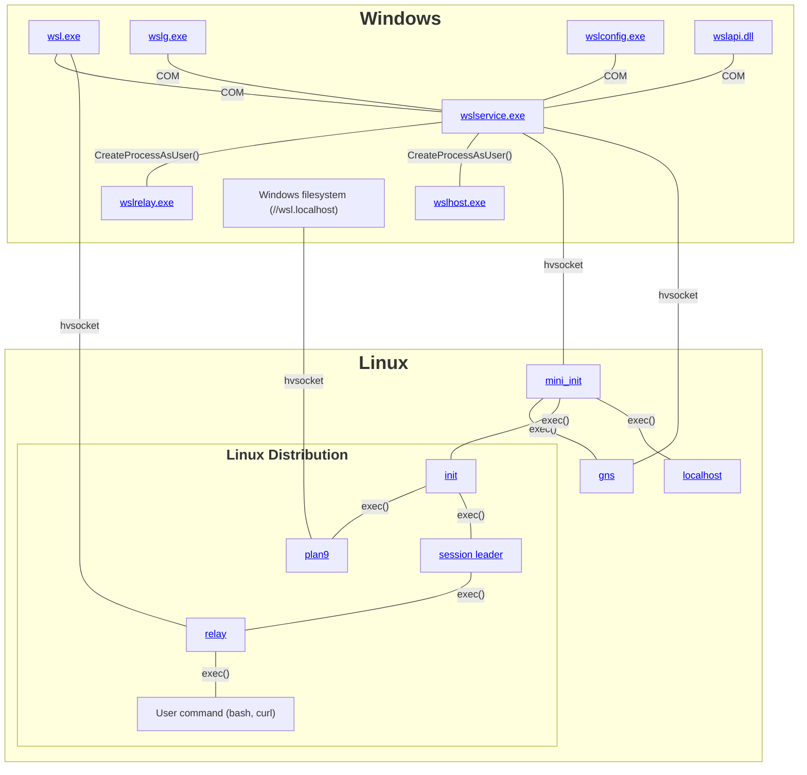
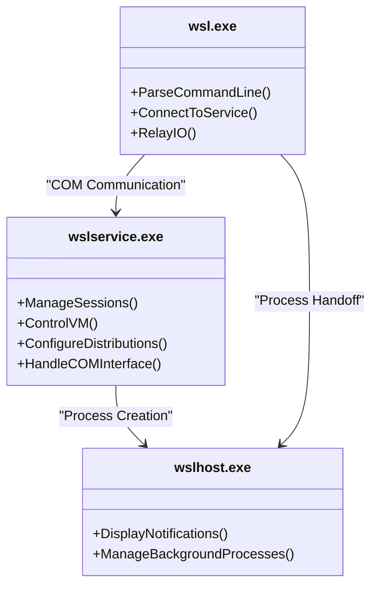
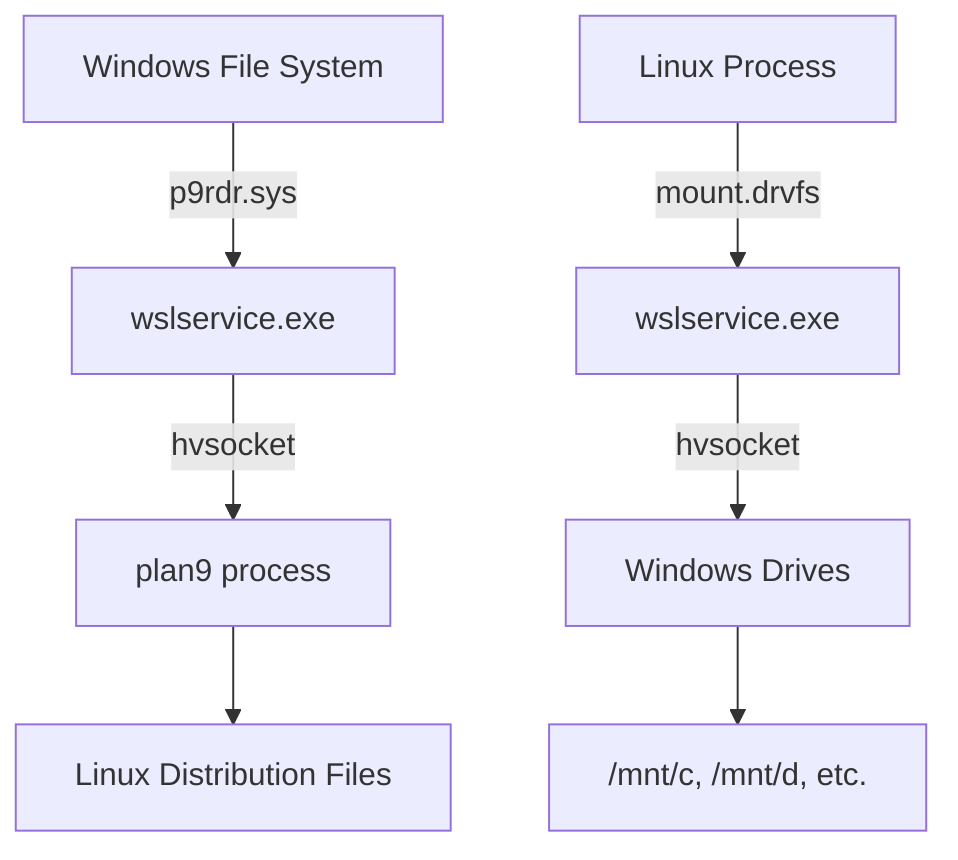
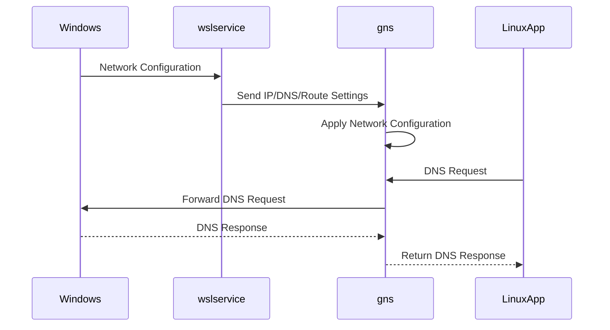
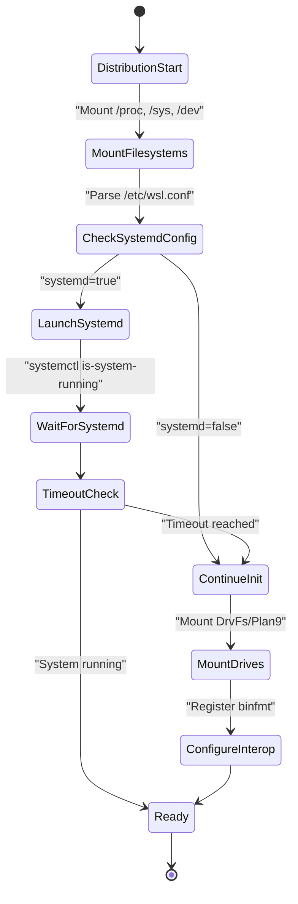

# Project Overview

<cite>
**Referenced Files in This Document**   
- [README.md](file://README.md)
- [CONTRIBUTING.md](file://CONTRIBUTING.md)
- [SECURITY.md](file://SECURITY.md)
- [DATA_AND_PRIVACY.md](file://DATA_AND_PRIVACY.md)
- [doc/docs/technical-documentation/index.md](file://doc/docs/technical-documentation/index.md)
- [doc/docs/technical-documentation/wsl.exe.md](file://doc/docs/technical-documentation/wsl.exe.md)
- [doc/docs/technical-documentation/wslservice.exe.md](file://doc/docs/technical-documentation/wslservice.exe.md)
- [doc/docs/technical-documentation/wslhost.exe.md](file://doc/docs/technical-documentation/wslhost.exe.md)
- [doc/docs/technical-documentation/init.md](file://doc/docs/technical-documentation/init.md)
- [doc/docs/technical-documentation/drvfs.md](file://doc/docs/technical-documentation/drvfs.md)
- [doc/docs/technical-documentation/plan9.md](file://doc/docs/technical-documentation/plan9.md)
- [doc/docs/technical-documentation/gns.md](file://doc/docs/technical-documentation/gns.md)
- [doc/docs/technical-documentation/interop.md](file://doc/docs/technical-documentation/interop.md)
- [doc/docs/technical-documentation/systemd.md](file://doc/docs/technical-documentation/systemd.md)
- [src/windows/common/wslclient.cpp](file://src/windows/common/wslclient.cpp)
- [src/windows/service/LxssUserSessionFactory.cpp](file://src/windows/service/LxssUserSessionFactory.cpp)
- [src/windows/service/WslCoreVm.cpp](file://src/windows/service/WslCoreVm.cpp)
- [src/windows/service/WslCoreInstance.cpp](file://src/windows/service/WslCoreInstance.cpp)
- [src/linux/init.cpp](file://src/linux/init.cpp)
- [src/linux/drvfs.cpp](file://src/linux/drvfs.cpp)
- [src/linux/init/GnsEngine.cpp](file://src/linux/init/GnsEngine.cpp)
- [src/linux/init/binfmt.cpp](file://src/linux/init/binfmt.cpp)
</cite>

## Table of Contents
1. [Introduction](#introduction)
2. [Architecture Overview](#architecture-overview)
3. [Core Components](#core-components)
4. [File System Integration](#file-system-integration)
5. [Networking Architecture](#networking-architecture)
6. [Cross-Platform Interoperability](#cross-platform-interoperability)
7. [System Management and Configuration](#system-management-and-configuration)
8. [Security and Privacy](#security-and-privacy)
9. [Development and Contribution](#development-and-contribution)
10. [User Workflows](#user-workflows)

## Introduction

Windows Subsystem for Linux (WSL) is a compatibility layer that enables native execution of Linux binaries on Windows without requiring traditional virtual machines or dual-boot configurations. WSL provides developers with seamless access to Linux command-line tools, utilities, and applications directly within the Windows environment. The system supports two architectural approaches: WSL1, which uses binary translation to run Linux system calls on Windows, and WSL2, which leverages lightweight virtualization through a managed Linux kernel to provide full system call compatibility.

WSL enables key use cases including cross-platform development, access to Linux-native tools and package managers, containerized workflows with Docker, and GUI application support through WSLg. The architecture integrates Windows and Linux components through various bridging technologies including DrvFs for file system access, Plan9 for file sharing, and GNS (Guest Network Service) for networking integration. This document provides a comprehensive overview of the WSL architecture, core components, and operational principles.

**Section sources**
- [README.md](file://README.md)

## Architecture Overview

The WSL architecture consists of tightly integrated Windows and Linux components that work together to provide a seamless Linux experience on Windows. The system is built around several core executables and services that manage the lifecycle of Linux distributions, process execution, and cross-platform integration.



**Diagram sources**
- [doc/docs/technical-documentation/index.md](file://doc/docs/technical-documentation/index.md)

## Core Components

WSL's functionality is distributed across several key components that work together to provide the Linux experience on Windows. The primary components include wsl.exe (the command-line interface), wslservice.exe (the system service), and wslhost.exe (the background process manager).

The wsl.exe component serves as the main command-line entry point for WSL operations. It parses command-line arguments and communicates with wslservice.exe via COM interfaces to launch WSL distributions and relay input/output streams between Windows and Linux processes. The wslservice.exe component runs as a session 0 service under the SYSTEM account and is responsible for managing WSL sessions, communicating with the WSL2 virtual machine, and configuring distributions. It exposes a COM interface (ILxssUserSession) that allows clients to create instances, launch processes, register distributions, and shut down WSL environments.

The wslhost.exe component serves dual purposes: it acts as a COM server for displaying desktop notifications to users about WSL updates, configuration errors, or proxy changes, and it manages the lifetime of Linux processes when wsl.exe terminates. This ensures that background Linux processes can continue running even after the terminal window is closed.



**Diagram sources**
- [doc/docs/technical-documentation/wsl.exe.md](file://doc/docs/technical-documentation/wsl.exe.md)
- [doc/docs/technical-documentation/wslservice.exe.md](file://doc/docs/technical-documentation/wslservice.exe.md)
- [doc/docs/technical-documentation/wslhost.exe.md](file://doc/docs/technical-documentation/wslhost.exe.md)

**Section sources**
- [doc/docs/technical-documentation/wsl.exe.md](file://doc/docs/technical-documentation/wsl.exe.md#L3-L9)
- [doc/docs/technical-documentation/wslservice.exe.md](file://doc/docs/technical-documentation/wslservice.exe.md#L3-L33)
- [doc/docs/technical-documentation/wslhost.exe.md](file://doc/docs/technical-documentation/wslhost.exe.md#L3-L23)
- [src/windows/common/wslclient.cpp](file://src/windows/common/wslclient.cpp)
- [src/windows/service/LxssUserSessionFactory.cpp](file://src/windows/service/LxssUserSessionFactory.cpp)
- [src/windows/service/WslCoreVm.cpp](file://src/windows/service/WslCoreVm.cpp)

## File System Integration

WSL provides bidirectional file system access between Windows and Linux through several integration mechanisms, with DrvFs and Plan9 being the primary technologies. DrvFs (Drive File System) allows Linux distributions to access Windows drives mounted under /mnt (e.g., /mnt/c for the C: drive), while Plan9 enables Windows to access files within Linux distributions through the \\wsl$ or \\wsl.localhost network paths.

The file system integration supports both elevated (administrator) and non-elevated (user) contexts by maintaining separate mount namespaces within each distribution. When a Linux process is created, wslservice.exe determines its elevation status and directs init to create the process in the appropriate namespace. This separation ensures proper security boundaries while allowing flexible access to Windows resources.

For WSL2 distributions, the Plan9 file server is started by wslservice.exe when a session leader is created. The server runs within the Linux environment and communicates with Windows through hvsocket connections. From the Windows side, the p9rdr.sys redirector driver handles access to \\wsl$ and \\wsl.localhost paths by communicating with wslservice.exe to start distributions and connect to their Plan9 servers.



**Diagram sources**
- [doc/docs/technical-documentation/drvfs.md](file://doc/docs/technical-documentation/drvfs.md)
- [doc/docs/technical-documentation/plan9.md](file://doc/docs/technical-documentation/plan9.md)
- [src/linux/drvfs.cpp](file://src/linux/drvfs.cpp)

**Section sources**
- [doc/docs/technical-documentation/drvfs.md](file://doc/docs/technical-documentation/drvfs.md#L1-L35)
- [doc/docs/technical-documentation/plan9.md](file://doc/docs/technical-documentation/plan9.md#L1-L19)
- [src/linux/drvfs.cpp](file://src/linux/drvfs.cpp)
- [src/linux/init/plan9.cpp](file://src/linux/init/plan9.cpp)

## Networking Architecture

The networking architecture in WSL2 is managed by the GNS (Guest Network Service) component, which configures and maintains network settings for the virtualized Linux environment. Unlike WSL1 which used a translation layer, WSL2 employs a lightweight virtual machine with its own network stack, requiring more sophisticated network integration.

The gns process, created by mini_init during VM startup, maintains an hvsocket channel to wslservice.exe to receive network configuration updates. This includes IP address assignment, routing table entries, DNS configuration, and MTU size settings. All WSL2 distributions share the same networking configuration, enabling consistent network behavior across multiple distributions running simultaneously.

When DNS tunneling is enabled, gns also handles DNS request resolution, allowing Linux applications to resolve hostnames using Windows DNS settings. The networking integration ensures that Linux services can be accessed from Windows (and vice versa) while maintaining appropriate security boundaries. The architecture supports both NAT networking (default) and bridged networking configurations, with options to control port forwarding and firewall integration.



**Diagram sources**
- [doc/docs/technical-documentation/gns.md](file://doc/docs/technical-documentation/gns.md)
- [src/linux/init/GnsEngine.cpp](file://src/linux/init/GnsEngine.cpp)
- [src/windows/service/exe/GnsChannel.cpp](file://src/windows/service/exe/GnsChannel.cpp)

**Section sources**
- [doc/docs/technical-documentation/gns.md](file://doc/docs/technical-documentation/gns.md#L1-L16)
- [src/linux/init/GnsEngine.cpp](file://src/linux/init/GnsEngine.cpp)
- [src/windows/service/exe/GnsChannel.cpp](file://src/windows/service/exe/GnsChannel.cpp)

## Cross-Platform Interoperability

WSL enables bidirectional interoperability between Windows and Linux environments, allowing users to run Windows executables from Linux and Linux commands from Windows. The interop system is controlled by both system-wide registry settings (HKEY_LOCAL_MACHINE\SYSTEM\CurrentControlSet\Services\LxssManager\DistributionFlags) and distribution-specific configuration in /etc/wsl.conf.

The core mechanism for running Windows executables from Linux involves binfmt (binary format) interpreters. WSL registers a binfmt interpreter entry in /proc/sys/fs/binfmt_misc that points to /init. When a Windows executable (typically with a .exe extension) is invoked from the Linux command line, the kernel routes the execution request to /init, which then handles the Windows process creation.

Each session leader and init instance has an associated interop server running as a Linux process that bridges communication between Linux and Windows. The /init process uses the $WSL_INTEROP environment variable to locate the appropriate server, connecting via Unix sockets under /run/WSL. Once connected, /init sends a process creation message that is forwarded to the corresponding Windows process (wsl.exe or wslhost.exe), which launches the requested Windows application and relays its output back to the Linux environment.

```mermaid
flowchart LR
A["Linux Shell"] --> |execve(.exe)| B[/init]
B --> |Check $WSL_INTEROP| C[/run/WSL/*_interop]
C --> D[Interop Server]
D --> |LxInitMessageCreateProcess| E[wsl.exe/wslhost.exe]
E --> F[Windows Process]
F --> E
E --> D
D --> C
C --> B
B --> A
```

**Diagram sources**
- [doc/docs/technical-documentation/interop.md](file://doc/docs/technical-documentation/interop.md)
- [src/linux/init/binfmt.cpp](file://src/linux/init/binfmt.cpp)

**Section sources**
- [doc/docs/technical-documentation/interop.md](file://doc/docs/technical-documentation/interop.md#L1-L30)
- [src/linux/init/binfmt.cpp](file://src/linux/init/binfmt.cpp)

## System Management and Configuration

WSL provides flexible configuration options through multiple mechanisms, including per-distribution settings in /etc/wsl.conf and system-wide settings via .wslconfig files. The init process plays a central role in system management, handling distribution initialization tasks such as mounting /proc, /sys, and /dev file systems, configuring cgroups, and parsing configuration files.

Systemd support can be enabled in WSL distributions by setting systemd=true in the [boot] section of /etc/wsl.conf. When enabled, the WSL init process forks and launches systemd as pid 1 in the parent process while continuing WSL-specific configuration in the child process. The init process waits for systemd to reach a "running" or "degraded" state before proceeding, with timeout protection to ensure the distribution starts even if systemd initialization is delayed.

To ensure compatibility with systemd, WSL creates protective configuration files under /run that prevent systemd services from removing critical WSL components such as the binfmt interpreter and X11 sockets. The architecture also supports session management through the session leader pattern, where each user session is managed by a dedicated process that handles process creation and lifetime management within the distribution.



**Section sources**
- [doc/docs/technical-documentation/init.md](file://doc/docs/technical-documentation/init.md#L1-L36)
- [doc/docs/technical-documentation/systemd.md](file://doc/docs/technical-documentation/systemd.md#L1-L24)
- [src/linux/init.cpp](file://src/linux/init.cpp)

## Security and Privacy

WSL implements multiple security layers to protect both the Windows host and Linux distributions. The architecture maintains separation between elevated and non-elevated processes through separate mount namespaces, preventing privilege escalation through file system access. The interop system includes configurable security policies that can disable Windows process execution from Linux at both the system and distribution levels.

Privacy considerations are addressed through transparent telemetry collection practices. WSL collects diagnostic data using Windows telemetry to monitor usage patterns, stability issues, and performance metrics. This data helps prioritize development efforts and improve system reliability. Users can disable telemetry collection through Windows Settings by navigating to Privacy and Security → Diagnostics & Feedback and disabling diagnostic data collection.

Security vulnerabilities should be reported through the Microsoft Security Response Center (MSRC) rather than public channels. The project follows Microsoft's Coordinated Vulnerability Disclosure principle, ensuring responsible handling of security issues. Users are advised not to report Windows crashes (BSODs) or security issues through public GitHub issues but to send them to secure@microsoft.com for proper handling.

**Section sources**
- [SECURITY.md](file://SECURITY.md)
- [DATA_AND_PRIVACY.md](file://DATA_AND_PRIVACY.md)

## Development and Contribution

The WSL project welcomes contributions from the community, including feature development, bug fixes, and documentation improvements. Contributors are encouraged to file issues before starting work to ensure alignment with project goals. The development process is documented in the dev-loop.md guide, which provides instructions for building WSL from source and understanding its architecture.

Contributions require agreement to a Contributor License Agreement (CLA) that grants Microsoft the rights to use the contributed code. The project has adopted the Microsoft Open Source Code of Conduct, which all participants are expected to follow. Development discussions and issue tracking occur primarily through GitHub, with separate repositories for different components such as the WSL2 Linux kernel and WSLg (GUI support).

The codebase uses a CMake-based build system with comprehensive testing infrastructure. Unit tests are available for both Linux and Windows components, and diagnostic tools are provided for collecting logs related to networking issues, process crashes, and system performance. The project also provides scripts for automated log collection to assist in troubleshooting and issue reporting.

**Section sources**
- [CONTRIBUTING.md](file://CONTRIBUTING.md)
- [doc/docs/dev-loop.md](file://doc/docs/dev-loop.md)

## User Workflows

Common user workflows with WSL begin with installation using the wsl --install command, which sets up the default Linux distribution and configures the WSL environment. Users can then manage distributions using commands like wsl --list, wsl --set-default, and wsl --unregister.

Daily usage typically involves launching a Linux distribution through wsl.exe, where users can access their preferred shell and Linux tools. File system integration allows seamless access to Windows files from Linux (/mnt/c, /mnt/d) and Linux files from Windows (\\wsl.localhost\distro-name). Networking integration enables running Linux servers that are accessible from Windows applications and vice versa.

Configuration is managed through /etc/wsl.conf for distribution-specific settings and .wslconfig for global WSL settings. Users can enable systemd support, configure resource limits, and customize file system behavior through these configuration files. The wslg component enables running Linux GUI applications with full integration into the Windows desktop environment, including support for audio, GPU acceleration, and system tray integration.

**Section sources**
- [README.md](file://README.md#L13-L17)
- [doc/docs/technical-documentation/wsl.exe.md](file://doc/docs/technical-documentation/wsl.exe.md)