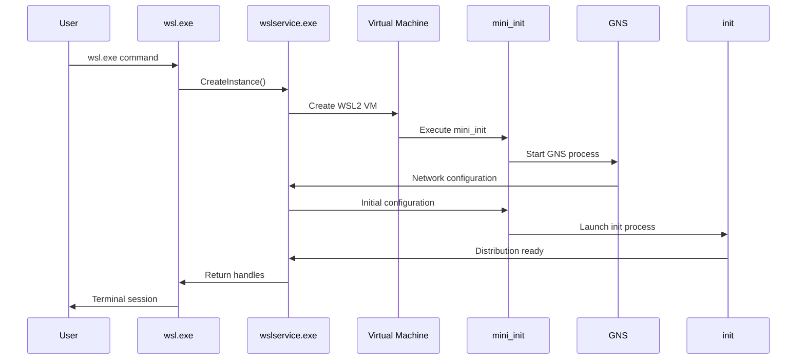

# Troubleshooting WSL Issues

<cite>
**Referenced Files in This Document**
- [collect-wsl-logs.ps1](file://diagnostics/collect-wsl-logs.ps1)
- [collect-networking-logs.ps1](file://diagnostics/collect-networking-logs.ps1)
- [install-latest-wsl.ps1](file://triage/install-latest-wsl.ps1)
- [dump-init-stacks.sh](file://diagnostics/dump-init-stacks.sh)
- [networking.sh](file://diagnostics/networking.sh)
- [main.cpp](file://src/linux/init/main.cpp)
- [LxssInstance.cpp](file://src/windows/service/exe/LxssInstance.cpp)
- [WslCoreVm.cpp](file://src/windows/service/exe/WslCoreVm.cpp)
- [GnsEngine.cpp](file://src/linux/init/GnsEngine.cpp)
- [telemetry.cpp](file://src/linux/init/telemetry.cpp)
- [boot-process.md](file://doc/docs/technical-documentation/boot-process.md)
- [init.md](file://doc/docs/technical-documentation/init.md)
- [gns.md](file://doc/docs/technical-documentation/gns.md)
- [debugging.md](file://doc/docs/debugging.md)
</cite>

## Table of Contents
1. [Introduction](#introduction)
2. [Diagnostic Tools Overview](#diagnostic-tools-overview)
3. [Common WSL Issues](#common-wsl-issues)
4. [System Logs Collection](#system-logs-collection)
5. [Network Connectivity Problems](#network-connectivity-problems)
6. [Initialization Failures](#initialization-failures)
7. [Performance Degradation](#performance-degradation)
8. [File System Issues](#file-system-issues)
9. [Advanced Debugging Techniques](#advanced-debugging-techniques)
10. [Prevention Strategies](#prevention-strategies)
11. [Troubleshooting Workflow](#troubleshooting-workflow)

## Introduction

Windows Subsystem for Linux (WSL) is a powerful technology that enables Linux environments to run natively on Windows. However, like any complex system, WSL can encounter various issues during installation, operation, and maintenance. This comprehensive troubleshooting guide provides systematic approaches to diagnose, identify, and resolve common WSL problems.

The WSL ecosystem consists of multiple components working together:
- **Windows-side components**: wsl.exe, wslservice.exe, wslhost.exe
- **Virtual Machine components**: mini_init, init, gns (guest network service)
- **Linux kernel**: Custom WSL2 Linux kernel
- **Networking infrastructure**: HNS (Host Network Service), DNS tunneling

Understanding these components and their interactions is crucial for effective troubleshooting.

## Diagnostic Tools Overview

WSL provides several diagnostic tools designed to collect comprehensive information about system state, network configuration, and operational logs. These tools are essential for identifying root causes of issues.

### Primary Diagnostic Scripts

#### collect-wsl-logs.ps1
The primary log collection script gathers comprehensive system information including:
- Registry exports for WSL-related configurations
- Service status information
- Windows Performance Recorder traces
- Memory dumps of critical processes
- System version and component information

**Key Features:**
- Supports multiple log profiles (default, storage, hvsocket)
- Automatic collection of Windows and Linux system state
- Integration with Windows Performance Recorder (WPR)
- Memory dump generation for debugging crashes

#### collect-networking-logs.ps1
Specialized network diagnostic script focusing on networking infrastructure:
- Windows networking state collection
- Linux networking configuration extraction
- HNS (Host Network Service) diagnostics
- Packet capture and network monitoring

**Key Features:**
- Pre- and post-reproduction state comparison
- Integration with pktmon for packet capture
- WFP (Windows Filtering Platform) diagnostics
- TCP/IP stack analysis

#### install-latest-wsl.ps1
Recovery script for resolving installation issues:
- Automated download and installation of latest WSL version
- System architecture detection (x64/arm64)
- MSI package installation with error handling

**Key Features:**
- Automatic GitHub API integration for latest releases
- Silent installation with minimal user interaction
- Error reporting and cleanup

### Linux Diagnostic Tools

#### dump-init-stacks.sh
Init process stack dumping utility:
- Process enumeration and state inspection
- Thread stack analysis
- File descriptor examination
- Memory usage reporting

#### networking.sh
Linux-side networking diagnostic script:
- Network interface configuration
- Routing table analysis
- Firewall rule inspection
- DNS configuration verification

**Section sources**
- [collect-wsl-logs.ps1](file://diagnostics/collect-wsl-logs.ps1#L1-L172)
- [collect-networking-logs.ps1](file://diagnostics/collect-networking-logs.ps1#L1-L320)
- [install-latest-wsl.ps1](file://triage/install-latest-wsl.ps1#L1-L60)
- [dump-init-stacks.sh](file://diagnostics/dump-init-stacks.sh#L1-L28)
- [networking.sh](file://diagnostics/networking.sh#L1-L64)

## Common WSL Issues

### Failed Installations

Installation failures can occur due to various reasons including system requirements, conflicting software, or corrupted installation files.

**Symptoms:**
- Installation hangs or fails immediately
- Error messages about missing dependencies
- Windows Features dialog shows WSL as disabled
- System compatibility warnings

**Common Causes:**
- Insufficient system requirements (Windows version, hardware virtualization)
- Conflicting virtualization software (VMware, VirtualBox)
- Corrupted Windows update cache
- Insufficient disk space

**Resolution Steps:**
1. Verify system requirements using `wsl --status`
2. Check for conflicting virtualization software
3. Clear Windows update cache: `wuauclt /resetauthorization /detectnow`
4. Run Windows Update to ensure system is current
5. Use the recovery script: `install-latest-wsl.ps1`

### Network Connectivity Problems

Network issues are among the most common WSL problems, affecting internet access, DNS resolution, and inter-distribution communication.

**Symptoms:**
- Cannot access external websites
- DNS resolution failures
- Slow network performance
- Intermittent connectivity issues

**Common Causes:**
- Incorrect DNS configuration
- Firewall blocking WSL traffic
- HNS (Host Network Service) issues
- Virtual switch configuration problems

### Initialization Failures

Init process failures prevent WSL distributions from starting properly.

**Symptoms:**
- WSL terminates immediately after startup
- "Failed to initialize" error messages
- Infinite loading screens
- Process crashes during boot

**Common Causes:**
- Corrupted distribution files
- Mini_init process failures
- GNS (Guest Network Service) initialization issues
- Kernel panic conditions

### Performance Degradation

Performance issues can manifest as slow response times, high CPU usage, or excessive memory consumption.

**Symptoms:**
- Slow command execution
- High CPU utilization
- Memory leaks
- Unresponsive terminal sessions

**Common Causes:**
- Resource contention
- File system performance issues
- Network bottlenecks
- Misconfigured system settings

### File System Corruption

File system issues can lead to data loss, access permissions problems, or system instability.

**Symptoms:**
- Permission denied errors
- File access failures
- Corrupted distribution state
- Mount failures

**Common Causes:**
- Improper shutdowns
- Disk space exhaustion
- Concurrent access conflicts
- Hardware issues

## System Logs Collection

Proper log collection is essential for diagnosing WSL issues. The diagnostic scripts automate this process and ensure comprehensive coverage.

### Using collect-wsl-logs.ps1

The primary log collection script provides automated gathering of system information.

**Basic Usage:**
```powershell
# Run basic log collection
.\collect-wsl-logs.ps1

# Collect with dump generation for crash analysis
.\collect-wsl-logs.ps1 -Dump
```

**Log Profiles:**
- **Default**: Standard WSL operation logs
- **Storage**: Storage subsystem diagnostics
- **Hvsocket**: Virtual socket communication logs

**Log Collection Process:**
1. Creates timestamped output directory
2. Exports registry keys for WSL configuration
3. Collects Windows service and component information
4. Starts Windows Performance Recorder trace
5. Waits for user reproduction of issue
6. Stops tracing and packages results

### Log Analysis Workflow

**Step 1: Extract and Examine Logs**
```powershell
# Extract collected logs
Expand-Archive -Path "WslLogs-*.zip" -DestinationPath ".\extracted_logs"

# Review system information
Get-Content ".\extracted_logs\system-info.txt"
```

**Step 2: Analyze WSL Service Status**
```powershell
# Check WSL service health
Get-Service wslservice | Format-List *
```

**Step 3: Review Registry Configuration**
```powershell
# Examine WSL registry settings
Get-ItemProperty -Path "HKLM:\SOFTWARE\Microsoft\Windows\CurrentVersion\Lxss" -ErrorAction SilentlyContinue
```

**Section sources**
- [collect-wsl-logs.ps1](file://diagnostics/collect-wsl-logs.ps1#L1-L172)

## Network Connectivity Problems

Network issues in WSL can stem from multiple sources including Windows networking infrastructure, virtual machine networking, and Linux network configuration.

### Diagnosing Network Issues

#### Using collect-networking-logs.ps1

The networking diagnostic script provides comprehensive network state analysis.

**Basic Network Diagnostics:**
```powershell
# Run network diagnostics
.\collect-networking-logs.ps1

# Force restart and recreate network state
.\collect-networking-logs.ps1 -RestartWslReproMode
```

**Key Information Collected:**
- Windows network adapters and configurations
- HNS (Host Network Service) state
- Virtual switch configurations
- Firewall rules affecting WSL
- Linux networking configuration

#### Manual Network Testing

**DNS Resolution Testing:**
```bash
# Test DNS resolution from Linux
nslookup microsoft.com
dig google.com

# Check DNS configuration
cat /etc/resolv.conf
cat /etc/nsswitch.conf
```

**Network Interface Verification:**
```bash
# Check network interfaces
ip addr show
ip route show
ip neighbor

# Test connectivity
ping -c 4 8.8.8.8
traceroute google.com
```

### Common Network Issues

#### DNS Resolution Failures

**Symptoms:**
- Websites cannot be accessed
- Domain names resolve to incorrect IPs
- Intermittent DNS timeouts

**Diagnosis Steps:**
1. Check DNS server configuration
2. Test DNS resolution from Windows
3. Verify HNS network connectivity
4. Examine DNS tunneling status

**Resolution:**
```bash
# Reset DNS configuration
sudo systemctl restart systemd-resolved
sudo resolvectl flush-caches

# Alternative: Edit /etc/resolv.conf
echo "nameserver 8.8.8.8" | sudo tee /etc/resolv.conf
```

#### Firewall Blocking Issues

**Symptoms:**
- Specific ports blocked
- Outbound connections failing
- Intermittent connectivity

**Diagnosis:**
```powershell
# Check Windows Firewall rules
Get-NetFirewallRule | Where-Object {$_.DisplayName -like "*WSL*"}

# Test connectivity from Windows
Test-NetConnection -ComputerName google.com -Port 443
```

#### HNS Network Service Issues

**Symptoms:**
- WSL network connectivity lost
- Virtual machine network failures
- DNS tunneling problems

**Diagnosis:**
```powershell
# Check HNS network status
hnsdiag list networks

# Restart HNS service
Restart-Service hns
```

**Section sources**
- [collect-networking-logs.ps1](file://diagnostics/collect-networking-logs.ps1#L1-L320)
- [networking.sh](file://diagnostics/networking.sh#L1-L64)

## Initialization Failures

Initialization failures prevent WSL from starting properly and can be caused by various factors including corrupted files, configuration issues, or system-level problems.

### Understanding the Boot Process

WSL follows a specific boot sequence that can fail at different stages:



**Diagram sources**
- [boot-process.md](file://doc/docs/technical-documentation/boot-process.md#L9-L42)

### Common Initialization Issues

#### VM Creation Failures

**Symptoms:**
- "Failed to create virtual machine" errors
- HCS (Host Compute System) failures
- Virtualization platform conflicts

**Diagnosis:**
```powershell
# Check HCS service status
Get-Service HostComputeSystem

# Verify virtualization support
systeminfo | findstr /C:"Hyper-V"

# Check WSL installation
wsl --status
```

**Resolution:**
1. Ensure Hyper-V is enabled: `Enable-WindowsOptionalFeature -Online -FeatureName Microsoft-Hyper-V -All`
2. Verify virtualization is enabled in BIOS
3. Check for conflicting virtualization software
4. Restart Windows to apply changes

#### Mini_init Process Failures

**Symptoms:**
- Immediate WSL termination
- "mini_init failed" error messages
- No response to commands

**Diagnosis:**
```bash
# Check mini_init process
ps aux | grep mini_init

# Examine system logs
dmesg | tail -n 100
journalctl -u wsl
```

**Common Causes:**
- Corrupted initramfs
- Kernel module loading failures
- Memory allocation issues

#### GNS (Guest Network Service) Failures

The GNS process handles networking configuration within the WSL2 virtual machine.

**Symptoms:**
- Network connectivity issues
- DNS resolution failures
- Virtual machine network problems

**Diagnosis:**
```bash
# Check GNS process status
ps aux | grep gns

# Examine GNS logs
cat /var/log/gns.log

# Test network configuration
ip addr show
ip route show
```

**Common Causes:**
- HNS communication failures
- DNS tunneling configuration issues
- Network interface setup problems

### Advanced Initialization Debugging

#### Enabling Debug Console

Enable debug console for detailed initialization information:

```ini
# %USERPROFILE%\.wslconfig
[wsl2]
debugConsole=true
```

**Section sources**
- [boot-process.md](file://doc/docs/technical-documentation/boot-process.md#L1-L116)
- [init.md](file://doc/docs/technical-documentation/init.md#L1-L36)
- [gns.md](file://doc/docs/technical-documentation/gns.md#L1-L16)

## Performance Degradation

Performance issues in WSL can significantly impact productivity and user experience. These issues often stem from resource contention, inefficient configurations, or system-level problems.

### Identifying Performance Issues

#### Symptoms of Performance Problems

**Slow Command Execution:**
- Commands take unusually long to execute
- Interactive shells feel sluggish
- Background processes are delayed

**High Resource Usage:**
- Excessive CPU utilization
- Memory leaks or high consumption
- Disk I/O bottlenecks

**Unresponsive Behavior:**
- Terminal freezes or becomes unresponsive
- Long delays between keystrokes
- Process hangs or timeouts

### Performance Monitoring Tools

#### System Resource Monitoring

**Windows Performance Monitor:**
```powershell
# Monitor WSL processes
Get-Process -Name wsl*, wslservice | Format-Table Name, CPU, WorkingSet, PM

# Monitor disk I/O
Get-Counter "\LogicalDisk(*)\% Disk Time"
```

**Linux Performance Analysis:**
```bash
# Monitor system resources
top -b -n 1 | head -20
htop  # if installed

# Check disk I/O
iotop -o  # if installed
iostat -x 1

# Monitor network usage
iftop -i eth0  # if installed
```

#### WSL-Specific Performance Metrics

**Memory Usage Analysis:**
```bash
# Check memory usage
free -h
cat /proc/meminfo

# Monitor memory pressure
cat /proc/vmstat | grep -E "(pgpgin|pgpgout|pswpin|pswpout)"
```

**CPU Performance:**
```bash
# Check CPU usage
mpstat -P ALL 1 10

# Monitor scheduler activity
cat /proc/sched_debug
```

### Common Performance Bottlenecks

#### File System Performance

**DrvFs Performance Issues:**
- Large file operations are slow
- Frequent file system access
- Inefficient file sharing

**Optimization Strategies:**
```bash
# Use local file systems when possible
# Avoid heavy operations in /mnt/c/
# Consider using WSL2's native file system for large datasets
```

#### Network Performance

**DNS Resolution Overhead:**
```bash
# Optimize DNS configuration
echo "nameserver 1.1.1.1" | sudo tee /etc/resolv.conf
echo "nameserver 8.8.8.8" | sudo tee -a /etc/resolv.conf
```

**Network Stack Tuning:**
```bash
# Adjust TCP buffer sizes
echo "net.core.rmem_max = 16777216" | sudo tee -a /etc/sysctl.conf
echo "net.core.wmem_max = 16777216" | sudo tee -a /etc/sysctl.conf
```

#### Memory Management

**Memory Reclamation:**
```bash
# Configure memory reclamation settings
# Add to %USERPROFILE%\.wslconfig
[wsl2]
memoryReclamationMode=aggressive
pageReportingOrder=12
```

### Performance Optimization Strategies

#### System-Level Optimizations

**Resource Allocation:**
```ini
# %USERPROFILE%\.wslconfig
[wsl2]
memory=8GB      # Adjust based on system RAM
processors=4    # Match available CPU cores
swap=2GB        # Configure swap appropriately
```

**GPU Acceleration:**
```ini
# Enable GPU acceleration if supported
[wsl2]
gpuSupport=true
```

#### Application-Level Optimizations

**Package Management:**
```bash
# Use efficient package managers
# Consider using apt-fast or other accelerated package managers
```

**Development Environment:**
```bash
# Optimize development workflows
# Use incremental builds
# Cache dependencies appropriately
```

## File System Issues

File system problems in WSL can lead to data corruption, access permission errors, and system instability. Understanding the file system architecture helps in diagnosing and resolving these issues.

### WSL File System Architecture

WSL uses multiple file system types working together:

**Windows File Systems:**
- **DrvFs**: Windows file system mounted in Linux
- **9P**: Network file system protocol for Windows/Linux communication

**Linux File Systems:**
- **ext4**: Distribution file system
- **tmpfs**: Temporary file system
- **procfs**: Virtual file system for process information

### Common File System Issues

#### Permission Denied Errors

**Symptoms:**
- Cannot modify files in Windows drives
- Access denied for system directories
- Permission modification failures

**Diagnosis:**
```bash
# Check file permissions
ls -la /mnt/c/path/to/file
getfacl /mnt/c/path/to/file

# Verify mount options
mount | grep drvfs
```

**Resolution:**
```bash
# Fix permissions
chmod 755 /mnt/c/path/to/file
chown user:group /mnt/c/path/to/file

# Modify mount options in .wslconfig
[wsl2]
metadata=false  # Disable metadata for performance
```

#### File Locking Issues

**Symptoms:**
- Applications report file locks
- Cannot delete or modify locked files
- Concurrent access failures

**Diagnosis:**
```bash
# Check for file locks
lsof /mnt/c/path/to/file
fuser /mnt/c/path/to/file

# Monitor file system events
strace -e trace=file command
```

#### Disk Space Exhaustion

**Symptoms:**
- "No space left on device" errors
- Slow file operations
- System instability

**Diagnosis:**
```bash
# Check disk usage
df -h
du -sh /mnt/*

# Find large files
find /mnt -type f -exec du -h {} + | sort -rh | head -10
```

### File System Recovery Procedures

#### Recovering Corrupted Distributions

**Backup Current State:**
```bash
# Backup important data
tar -czf ~/wsl-backup.tar.gz /mnt/c/Users/username/.wsl.d/

# Export distribution
wsl --export Ubuntu ~/Ubuntu-backup.tar
```

**Reset Distribution:**
```bash
# Unregister and reinstall
wsl --unregister Ubuntu
wsl --install -d Ubuntu
```

#### Repairing File System Corruption

**Linux File System Checks:**
```bash
# Check and repair ext4 file system
sudo fsck.ext4 /dev/sda1

# Verify file system integrity
sudo e2fsck -f /dev/sda1
```

**Windows File System Checks:**
```powershell
# Check Windows file system
chkdsk C: /f /r

# Verify Windows updates
wuauclt /detectnow
```

### Preventive Measures

#### Regular Maintenance

**Scheduled Cleanup:**
```bash
# Clean up temporary files
sudo rm -rf /tmp/*
sudo apt clean

# Remove unused packages
sudo apt autoremove
```

**Backup Strategies:**
```bash
# Regular backup of important data
rsync -av --progress /mnt/c/Users/username/Documents/ ~/backup/

# Export distributions regularly
wsl --export Ubuntu ~/backups/Ubuntu-$(date +%Y%m%d).tar
```

#### Best Practices

**File System Usage:**
- Use local file systems for heavy operations
- Avoid frequent file system access in Windows drives
- Implement proper error handling in scripts
- Monitor disk space usage regularly

## Advanced Debugging Techniques

Advanced debugging techniques require deeper understanding of WSL internals and provide powerful tools for diagnosing complex issues.

### Debugging with Telemetry

WSL includes comprehensive telemetry and logging capabilities that provide insights into system behavior.

#### Enabling Debug Logging

**Windows Side:**
```powershell
# Enable WSL debug logging
Set-ItemProperty -Path "HKLM:\SOFTWARE\Microsoft\Windows\CurrentVersion\Lxss" -Name "LogLevel" -Value 4

# Restart WSL service
Restart-Service wslservice
```

**Linux Side:**
```bash
# Enable debug console
echo "[wsl2]" | sudo tee -a /etc/wsl.conf
echo "debugConsole=true" | sudo tee -a /etc/wsl.conf

# Restart WSL
wsl --shutdown
wsl
```

#### Analyzing Telemetry Data

**ETL Trace Analysis:**
```powershell
# Collect ETL traces
wpr.exe -start "Microsoft.Windows.Lxss.Manager" -filemode
# Reproduce issue
wpr.exe -stop traces.etl

# Analyze with Windows Performance Analyzer
wpa traces.etl
```

### Process Debugging

#### Attaching Debuggers

**Windows Processes:**
```powershell
# Attach WinDbg to WSL processes
# Use symbol path: srv*c:\symbols*https://msdl.microsoft.com/download/symbols
```

**Linux Processes:**
```bash
# Attach gdb to Linux processes
gdb -p $(pgrep init)
```

#### Memory Dump Analysis

**Generating Memory Dumps:**
```powershell
# Use the dump generation feature in collect-wsl-logs.ps1
.\collect-wsl-logs.ps1 -Dump
```

**Analyzing Dumps:**
```bash
# Analyze memory dumps with gdb
gdb /path/to/executable core.dump
```

### Network Debugging

#### Packet Capture Analysis

**Using pktmon:**
```powershell
# Start packet capture
pktmon start -c --flags 0x1A --file-name capture.etl

# Reproduce network issue
# Stop capture when done
pktmon stop
```

**Analyzing Captured Packets:**
```bash
# Convert ETL to readable format
netsh trace convert capture.etl
```

#### Network Stack Inspection

**Linux Network Debugging:**
```bash
# Detailed network interface statistics
cat /proc/net/dev
cat /proc/net/snmp

# Socket information
ss -tuln
netstat -i

# Routing table analysis
ip route show table all
ip rule show
```

### System Call Tracing

#### Using strace

**Basic System Call Monitoring:**
```bash
# Trace system calls for a process
strace -f -o trace.log command

# Monitor specific system calls
strace -e trace=open,read,write command
```

**Advanced Tracing:**
```bash
# Trace with timing information
strace -tt -o timing.log command

# Filter by system call group
strace -e trace=file command
```

### Container Integration Debugging

#### Docker Integration Issues

**Symptoms:**
- Docker containers fail to start
- Network connectivity problems
- Volume mounting issues

**Diagnosis:**
```bash
# Check Docker daemon status
docker info

# Test container networking
docker run --rm alpine ping -c 4 google.com

# Inspect volume mounts
docker volume inspect volume_name
```

**Resolution:**
```bash
# Restart Docker service
Restart-Service docker

# Reset Docker network configuration
docker network prune -f
```

**Section sources**
- [debugging.md](file://doc/docs/debugging.md#L1-L66)
- [telemetry.cpp](file://src/linux/init/telemetry.cpp#L1-L63)

## Prevention Strategies

Preventing WSL issues requires proactive system maintenance, proper configuration, and adherence to best practices.

### System Maintenance

#### Regular Updates

**Windows Updates:**
```powershell
# Keep Windows updated
wuauclt /detectnow
wuauclt /updatenow
```

**WSL Updates:**
```powershell
# Check for WSL updates
wsl --update

# Install latest WSL version
wsl --install
```

#### Scheduled Maintenance Tasks

**Daily Tasks:**
```bash
#!/bin/bash
# Daily WSL maintenance script

# Clean up temporary files
sudo rm -rf /tmp/*

# Update package databases
sudo apt update

# Remove unused packages
sudo apt autoremove -y
```

**Weekly Tasks:**
```bash
#!/bin/bash
# Weekly WSL maintenance script

# Check disk usage
df -h

# Clean package caches
sudo apt autoclean

# Check for system updates
sudo apt upgrade -y
```

### Configuration Best Practices

#### Optimal .wslconfig Settings

```ini
# %USERPROFILE%\.wslconfig
[wsl2]
# Memory allocation
memory=8GB

# CPU allocation
processors=4

# Swap configuration
swap=2GB

# Network settings
localhostForwarding=true

# GPU support
gpuSupport=true

# Debug console
debugConsole=true

# Performance tuning
pageReportingOrder=12
memoryReclamationMode=aggressive
```

#### Security Hardening

**File System Permissions:**
```bash
# Secure file system access
chmod 755 ~
chmod 600 ~/.ssh/*

# Proper ownership
chown -R user:user ~
```

**Network Security:**
```bash
# Secure network configuration
sudo ufw enable
sudo ufw default deny incoming
sudo ufw default allow outgoing
```

### Monitoring and Alerting

#### System Health Monitoring

**Resource Monitoring Script:**
```bash
#!/bin/bash
# WSL resource monitoring

MEMORY_THRESHOLD=80
CPU_THRESHOLD=80
DISK_THRESHOLD=90

# Check memory usage
MEMORY_USAGE=$(free | awk '/Mem/{printf("%.0f"), $3/$2*100.0}')
if [ $MEMORY_USAGE -gt $MEMORY_THRESHOLD ]; then
    echo "WARNING: Memory usage at ${MEMORY_USAGE}%"
fi

# Check CPU usage
CPU_USAGE=$(top -bn1 | grep "Cpu(s)" | sed "s/.*, *\([0-9.]*\)%* id.*/\1/" | awk '{print 100 - $1"%"}')
echo "CPU Usage: ${CPU_USAGE}"

# Check disk usage
DISK_USAGE=$(df -h /mnt/c | awk '/\/mnt\/c/ {print $5}' | sed 's/%//')
if [ $DISK_USAGE -gt $DISK_THRESHOLD ]; then
    echo "WARNING: Disk usage at ${DISK_USAGE}%"
fi
```

#### Automated Alerts

**Email Notifications:**
```bash
#!/bin/bash
# Email alert script

ALERT_EMAIL="admin@example.com"
SUBJECT="WSL System Alert"

# Send email with alerts
echo "System health check completed" | mail -s "$SUBJECT" $ALERT_EMAIL
```

### Development Environment Optimization

#### Efficient Development Workflows

**Version Control Optimization:**
```bash
# Use efficient Git configuration
git config --global core.autocrlf input
git config --global core.filemode true
```

**Build System Optimization:**
```bash
# Use parallel builds
export MAKEFLAGS="-j$(nproc)"

# Configure build caching
export CCACHE_DIR="/tmp/ccache"
export CCACHE_COMPRESS=true
```

#### Container Best Practices

**Docker Optimization:**
```dockerfile
# Efficient Dockerfile practices
FROM ubuntu:latest

# Minimize layers
RUN apt-get update && apt-get install -y \
    package1 \
    package2 \
    && apt-get clean \
    && rm -rf /var/lib/apt/lists/*

# Use .dockerignore
COPY . /app
WORKDIR /app
```

## Troubleshooting Workflow

A systematic approach to troubleshooting ensures efficient problem resolution and prevents recurrence of issues.

### Initial Assessment

#### Problem Classification

**Step 1: Identify the Issue Type**
- Installation failure
- Network connectivity
- Performance degradation
- File system corruption
- Application-specific issues

**Step 2: Gather Basic Information**
```powershell
# System information
wsl --status
systeminfo | findstr /C:"OS Version"
systeminfo | findstr /C:"Total Physical Memory"

# WSL version
wsl --version
```

#### Reproduction Steps

**Document the Issue:**
1. Exact steps to reproduce
2. Expected vs. actual behavior
3. Timing and frequency of occurrence
4. Error messages and codes

### Diagnostic Phase

#### Automated Collection

**Run Comprehensive Diagnostics:**
```powershell
# Collect system logs
.\collect-wsl-logs.ps1

# Collect networking logs
.\collect-networking-logs.ps1

# Package and review
```

#### Manual Investigation

**System State Analysis:**
```bash
# Check system health
uname -a
cat /proc/meminfo
cat /proc/cpuinfo

# Verify WSL configuration
cat /etc/wsl.conf
cat /etc/resolv.conf
```

### Analysis and Diagnosis

#### Pattern Recognition

**Common Issue Patterns:**
- Network connectivity: DNS resolution failures, firewall blocking
- Performance: Resource exhaustion, inefficient configurations
- Stability: Memory leaks, file system corruption

#### Root Cause Analysis

**Systematic Approach:**
1. Examine recent changes
2. Check system resources
3. Analyze error logs
4. Test individual components
5. Compare with known good configurations

### Resolution Implementation

#### Immediate Fixes

**Quick Resolutions:**
- Restart WSL: `wsl --shutdown`
- Reset network: `netsh winsock reset`
- Clear caches: `sudo apt clean`

#### Permanent Solutions

**Long-term Fixes:**
- Update configurations
- Apply patches
- Upgrade components
- Implement preventive measures

### Validation and Documentation

#### Verification

**Confirm Resolution:**
```bash
# Test functionality
ping -c 4 google.com
curl -I http://example.com
wsl --list --verbose
```

#### Documentation

**Record Solution:**
- Issue description
- Root cause analysis
- Resolution steps
- Preventive measures
- Lessons learned

### Post-Resolution Monitoring

#### Ongoing Monitoring

**Implementation:**
- Set up monitoring scripts
- Configure alerts
- Schedule regular maintenance
- Track system health metrics

#### Continuous Improvement

**Process Enhancement:**
- Update troubleshooting procedures
- Improve diagnostic tools
- Share knowledge with team
- Document lessons learned

## Conclusion

WSL troubleshooting requires understanding of multiple interconnected systems and components. By following the systematic approaches outlined in this guide, you can efficiently diagnose and resolve WSL issues while preventing future problems through proper maintenance and configuration.

Key takeaways:
- Use automated diagnostic tools for comprehensive system analysis
- Understand the WSL architecture to identify root causes
- Implement preventive measures to reduce issue frequency
- Maintain proper documentation for future reference
- Stay updated with WSL releases and best practices

Remember that WSL continues to evolve, and staying current with updates and community knowledge will enhance your troubleshooting capabilities.